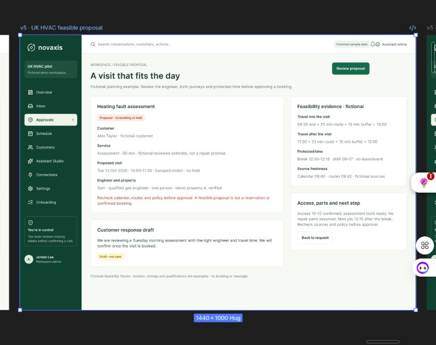
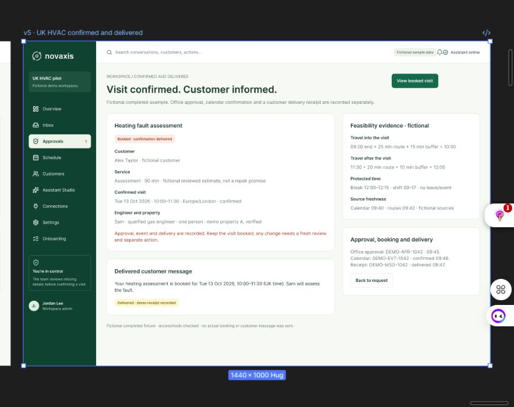

# UK HVAC proposal and confirmation — verified design checkpoint

10 October 2026. Role: senior UX/observability designer. Task: add an editable feasible proposal and a confirmed/delivered outcome while preserving existing designs.

## Completed and verified

Both new frames on `02 · Refined experience` were visually inspected after a successful Figma reload. Existing frames and components were preserved; extra text annotations remain below the screens, including at Y=2920.

- [v5 · UK HVAC feasible proposal](https://www.figma.com/design/KlfBnaMKECl18mVmwXplnP/?node-id=44-154), node `44:154`, X=16145, Y=1600, 1440×1000. Proposal is explicitly unbooked with no hold. Shows an assessment-specific estimate, engineer/crew and property fixture, both route legs, protected time, source freshness, access/tools and a customer draft that has not been sent. Recheck calendar, routes and policy before approval.
- [v5 · UK HVAC confirmed and delivered](https://www.figma.com/design/KlfBnaMKECl18mVmwXplnP/?node-id=44-292), node `44:292`, X=17625, Y=1600, 1440×1000. Separate fictional office approval, confirmed calendar event and delivery receipt. Retains feasibility context and a delivered-message example. Changes require a fresh review and separate action.

## Fixture evidence and limits

All customer, property, qualification, duration, calendar and route facts are synthetic examples. Property A is a symbolic location; this work did not verify an actual address, geocode, engineer qualification or tenant policy. The 90-minute assessment is a fictional reviewed estimate, not an activated service catalogue or repair guarantee.

Incoming: prior job ends 09:20 + route 25 minutes + buffer 15 minutes = 10:00. Assessment 10:00–11:30. Onward route 20 minutes + buffer 10 minutes reaches 12:00. Protected break 12:00–12:15; next job 12:15. Example shift 09:00–17:00, no leave/event conflict. Calendar freshness 09:40 and route freshness 09:42 are illustrative.

Completed fixture records approval `DEMO-APR-1042` at 09:45, calendar `DEMO-EVT-1042` confirmed at 09:46 and message `DEMO-MSG-1042` delivered at 09:47. No actual booking or customer message was executed.

Verification establishes editable desktop composition and persistence after reload. It does not establish prototype links, mobile parity, keyboard/screen-reader accessibility, provider integration or runtime behavior.

## Next concrete task

Design the intermediate approval review and checking states, including stale-source or changed-feasibility failures. Align the action gate with the tenant's actual policy; do not link Review proposal straight to a successful booking as though approval and execution were guaranteed. Then connect and verify the copied-frame journey with unknown-result and message-only recovery, complete mobile/accessibility work, and implement/test the runtime flow.
