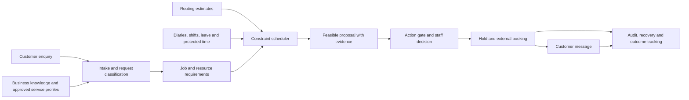

# Novaxis operational assistant: UK HVAC first

9 October 2026. Product strategist/researcher deliverable. This extends the current product and UK HVAC offer; it does not replace the work already built. The operating goal is to relieve the office through accurate intake, feasible scheduling, clear communication and controlled follow-up.

## Decision

Start with a hosted model API plus a business-owned service catalogue, knowledge store, scheduling engine and action gate. Prepare for an open-weight small language model later through the existing provider interface. Fine-tuning is a later experiment; training a foundation model from scratch is not an appropriate first investment.

Ownership now means owning the product, workflow rules, code, evaluations, customer relationships and appropriately permissioned data. Using an API does not prevent that ownership. Self-hosted model weights improve control of model execution but add infrastructure, licensing, security and reliability responsibilities. A fine-tuned model does not create live knowledge of a diary, road network or spreadsheet.

## What exists, and what must change

Source reviewed: `packages/core/novaxis_core/scheduling.py`, settings, gate, HVAC pack, `docs/models.md`, web approval/setup/schedule screens. Reviewed source is the copied public main branch; deployed configuration remains unverified.

| Capability | Present evidence | Required next step |
|---|---|---|
| Service-dependent job length | Configured `duration_minutes` is read; absent service/duration falls back to 60 minutes | Replace silent unknown-duration booking with a staff-estimate state or an explicitly approved diagnostic profile |
| Rest and calendar constraints | Protected recurring times, busy events, notice, buffers and daily caps | Add per-engineer availability, leave, holiday/closure policy and explicit rest constraints |
| Availability resources | A location/calendar and tenant appointments are used; `location_for` chooses the first location | Model actual engineer/crew/equipment resources and relevant locations; a tenant-wide busy list cannot represent multi-engineer dispatch accurately |
| Travel feasibility | Generic buffer is present; reviewed scheduling path does not query a routing matrix | Add verified property coordinates, route estimates and previous/new/next job feasibility |
| Holds and confirmation | Holds, expiry and external-calendar booking logic are present | Reserve assigned resources and recheck travel/availability at confirmation; test external races and partial success |
| Language/model portability | API and OpenAI-compatible provider options exist in source | Compare providers on the same HVAC evaluation set and real cost/latency before selection |
| Real model quality | `docs/models.md` records scripted-model results and describes the live demo as fake at the time of writing | Verify current configuration; scripted demo passes do not establish real AI competence |

The previous review understated existing scheduling support: rest-like protected times and configurable durations already exist. The gap is richer evidence and resource-aware planning, rather than starting scheduling from nothing.

## Required assistant skills

### 1. Understand the service request

Classify what the customer needs: planned maintenance, fault assessment, quote/survey, existing-job follow-up or urgent escalation. Identify the relevant questions, requested service, urgency and uncertainty. Do not infer a definitive fault or advise unsafe repairs from a chat description.

Build service profiles with a UK HVAC practitioner: problem categories, supported systems, necessary questions, engineer qualifications, crew/equipment, parts/access prerequisites, diagnostic-visit option and planning-duration range. The assistant uses approved profiles and comparable completed-job evidence. Never invent universal boiler repair times.

Ask one useful missing question at a time. If timing is uncertain, offer a diagnostic visit or staff estimate. Major work needs a survey or approved project estimate, not a short slot guessed from customer wording.

### 2. Understand place and travel

Verify postcode, then confirm the actual property and access details when a visit is proposed. A postcode gives rough location, not a precise property arrival estimate. Use a routing tool for travel minutes, departure context and estimate freshness. Include parking/access allowance and travel uncertainty; static routing is not live traffic.

For each candidate engineer, check previous job/base → new job → next job/base. Both journeys matter. Avoid over-sharing: the language model can receive a travel result and an opaque address reference, while the authorized routing service receives only necessary coordinates. Routing coordinates remain potentially personal data; evaluate the provider and customer agreement.

### 3. Protect people and capacity

Read shifts, leave, existing commitments, breaks, required rest, training, equipment and business closures. A calendar gap alone is insufficient. Treat the reason for a private event as unnecessary unless operationally relevant; store busy intervals rather than private event text where possible.

Use the appropriate UK bank-holiday region and the company's explicit closure/on-call policy. A bank holiday is not an automatic closure. GOV.UK offers bank-holiday data through its API catalogue. Normal adult rest rules include a 20-minute uninterrupted break when working over six hours and 11 hours between working days; applicability, exceptions, contracts and on-call patterns require the business's policy review. Configure those policies rather than have the model improvise employment rules.

Sources: [bank-holiday feed](https://www.api.gov.uk/gds/bank-holidays/), [rest breaks](https://www.gov.uk/rest-breaks-work).

### 4. Qualify an enquiry and communicate well

For the HVAC business's customers, quality means operational fit: service offered, area covered, timing workable, information sufficient and approved commercial terms understood. Keep uncertainty visible. Do not infer wealth or rank people by disability, health, accent or other sensitive traits. Safety and urgent escalation come before commercial opportunity ranking.

For Novaxis's own acquisition, quality means UK HVAC firms with a demonstrable unmet workflow, incoming demand, reachable buyer, compatible systems, staff to handle escalations and willingness to pay. Maintain evidence for each criterion. The prospect list is separate from tenant customer records.

Replies should explain the real next step, relevant reason and status in plain language. Storytelling means a coherent explanation of the customer's case and the team's action, not invented empathy, diagnosis, success stories or promised outcomes. For example, use a verified reason such as “That visit would leave too little travel time before the engineer's next job; these other windows fit.”

### 5. Connected sheets and business information

Begin with authorized read-only imports: service catalogue, duration history, engineer qualifications, leave/shift information and approved knowledge. Keep field provenance, updated time, validation failures and access scope. Map rows to stable IDs. Establish a source of truth for each field before allowing writes.

Do not treat a spreadsheet row as an executable instruction or use stale imported availability to confirm a visit. A sheet may be a useful pilot source without being the transactional booking system. Later writes require permission checks, row-version checks, idempotency and a conflict workflow. Isolation applies equally to retrieved documents and shared evaluation data.

### 6. Controlled outbound assistance

Agents can prepare and send permitted service messages through connected tools: appointment confirmations, requested updates, reminders and appropriate follow-up. Each send must respect opt-outs, message purpose, approved templates, timing, channel policy and audit history. Incoming contact is not blanket consent for unrelated marketing.

Cold acquisition is a separate workstream. The current gate rejects first-contact actions, so autonomous prospect outreach is not a current capability. Any future policy change needs a separately reviewed marketing workflow; do not weaken the existing gate merely to enable outreach. The assistant may prepare a qualified list and drafts now; no prospect messages were sent in this task.

ICO distinguishes UK corporate subscribers from sole traders/some partnerships, and personal-data requirements still apply. Social DMs and contact forms should not be assumed to bypass electronic-marketing rules. Confirm the applicable campaign/channel rules before activation. [ICO B2B guidance](https://ico.org.uk/for-organisations/direct-marketing-and-privacy-and-electronic-communications/business-to-business-marketing), [electronic-mail guidance](https://ico.org.uk/media/for-organisations/guide-to-pecr/guidance-on-direct-marketing-using-electronic-mail-1-0.pdf).

## Architecture: model explains; tools establish facts

Use the smallest scheduler that checks the necessary constraints. Start with inserting one visit into fixed existing diaries; global route re-optimisation and moving existing appointments is later work requiring staff control. OR-Tools supports route planning with time windows; it still requires a real travel-time matrix and accurately modeled service/shift constraints. [OR-Tools](https://developers.google.com/optimization/routing/vrptw).

Synthetic example: a prior job finishes at 10:00; driving takes 35 minutes and arrival allowance is 10 minutes. A 10:30 service start is infeasible even if the diary appears empty. Earliest start is 10:45, subject to duration, onward travel, breaks and the next commitment. This is a feasibility example, not an HVAC service-time recommendation.

## API, small model and training decision

| Option | Good use | Tradeoff | Decision |
|---|---|---|---|
| Hosted API model + retrieval/tools | Initial conversation, extraction, summaries and structured proposals | Provider data terms, token spend, latency and outages | Begin here after evaluations |
| Existing open-weight small model, hosted locally or privately | Trial narrow extraction/classification and summarisation | Compute, tool-use reliability, concurrency and operations | Benchmark offline with synthetic/de-identified cases |
| Fine-tune an existing small model | A repetitive task with stable labels and demonstrated baseline errors | Dataset rights, leakage, regression testing, compute and maintenance | Later, only if a controlled comparison proves useful |
| Train a new foundation model | Large-scale model-development programme | High data/compute/team cost and uncertain gain | Outside the initial product plan |

For predicting job length, start with business-approved service profiles and actual duration distributions. When enough comparable jobs exist, a small statistical/regression model can be more appropriate than language-model fine-tuning. Capture service category, complexity, crew, access, actual start/end and return visits. Use an uncertainty interval and conservative planning percentile selected with the business, not a falsely exact estimate.

Privacy is a system property. Keep tenant data separated; minimize context, protect credentials, redact sensitive logs, govern deletion/retention and record access. Fine-tuning can memorise personal information, and a privately hosted model still leaks data through poorly controlled logs or integrations. Do not put live changing facts such as leave, prices and addresses into model weights.

As one provider example, OpenAI states API data is not used to train models by default unless opted in. Its documentation also distinguishes endpoint application-state retention from abuse-monitoring logs, commonly retained up to 30 days, and eligibility/limitations for zero-data-retention controls. Check the exact endpoint, configuration and agreement; “not used for training” does not mean “nothing is retained.” [OpenAI data controls](https://developers.openai.com/api/docs/guides/your-data).

Qwen3-4B is one existing small-model candidate documented by its publisher, not a recommendation proven for Novaxis. Benchmark qualified candidates for JSON/schema validity, tool correctness, urgent handoff, incomplete-information handling, latency and cost on the same held-out cases. The repository mentions a CPU-only laptop, but that is a prior note rather than a fresh hardware measurement. [Publisher model card](https://huggingface.co/Qwen/Qwen3-4B).

Before fine-tuning: establish a baseline, obtain dataset rights, de-identify where suitable, separate training/test customers and time periods, measure actual errors and workload, prove superiority on held-out cases, test privacy leakage and maintain a rollback model. The current repository's no-training rule would need a documented scoped change when that experiment is actually authorized.

Self-hosting break-even: monthly inference-hosting + operations + amortised training/evaluation must be less than the API cost avoided, while meeting quality and reliability targets. Count idle compute, backups, support and retraining. There is no honest fixed break-even customer count without measured usage.

## Free resources and server plan

Use free resources for learning and controlled development; choose production services whose terms and reliability support paying users.

| Need | Low-cost starting approach | Limit to verify |
|---|---|---|
| Service knowledge | Existing pack files, versioned service profiles and practitioner review | Free text content is not verified operational knowledge |
| Job planning | Local scheduling code; OR-Tools when constraint complexity warrants it | Inputs, runtime budget and realistic fixtures |
| Routing | Evaluate a hosted routing provider or self-hosted OSRM for a bounded area | Commercial/privacy terms, map coverage, hosting, freshness and lack of live traffic |
| Holidays | GOV.UK regional bank-holiday feed plus business closure policy | Leave/private events still come from the business |
| Models | Existing local runtime for offline tests; capped hosted API for pilots | Laptop uptime is not a production service; token credits are not recurring free capacity |
| Data/server | Existing Supabase/Postgres and web/API deployment, within verified plans | Monitoring, backups, terms, pauses, job timers and reliable customer access |

OSRM provides routing/table APIs but requires hosting and map data if privately deployed. HeiGIT advertises free standard API access; the current plan page was not readable enough to confirm commercial quotas/terms, so they remain a provider-selection dependency. Do not use a public demo endpoint as a promised production service. [OSRM](https://project-osrm.org/docs/v5.24.0/api/), [HeiGIT](https://api.heigit.org/).

Important correction to “free hosting”: Vercel Hobby is restricted to personal/non-commercial use. Supabase documents inactivity pausing on Free projects. Verify current project plans rather than assume the existing commercial pilot can run indefinitely without fees. [Vercel terms](https://vercel.com/legal/terms), [Supabase pausing](https://supabase.com/docs/guides/platform/free-project-pausing).

Public Nominatim explicitly says not to submit personal or confidential data. It is not our default endpoint for customer property addresses. Select a suitable contracted/private geocoding path. [Nominatim policy](https://operations.osmfoundation.org/policies/nominatim/).

No new accounts, paid infrastructure or model-training jobs were created here. The repository already describes web/API hosting and a database; an owned physical server is not a prerequisite for owning the product.

## Core team and execution order

Initially: founder owns discovery, sales and decisions; a UK HVAC practitioner validates service/urgency/duration profiles; one accountable senior software/integration engineer implements the scheduler/data boundaries; a product designer completes Figma; AI evaluation and QA remain explicit responsibilities even if initially shared. Buy scoped privacy/operations review when needed. Add customer implementation support as paid usage grows.

The assistant can prepare artifacts, code and evaluations, but the business needs a human accountable for live escalation and incident response. “Senior roles” here means focused disciplines and evidence standards, not imaginary employees.

| Order | Primary role | Concrete task | Completion evidence |
|---|---|---|---|
| 1 | Product + HVAC domain expert | Define service taxonomy, diagnostic visit profiles, duration evidence and resource requirements | Reviewed service profiles; missing facts explicitly marked |
| 2 | UX/observability | Complete Figma request details, duration source, assigned engineer, travel, unavailable time and recovery | Every proposed slot explains feasibility and uncertainty |
| 3 | Software/integration | Remove silent unknown-duration confirmation; add resources, route adapter and insertion checks | Controlled examples reject infeasible travel, breaks, leave and unqualified assignment |
| 4 | AI engineer + QA | Compare API and existing small model with the same job scenarios | Tool/constraint correctness, handoff, latency and cost evidence |
| 5 | Integration | Read-only sheet/calendar ingestion with field authority and freshness | Stale/conflicting rows cannot confirm a booking |
| 6 | Implementation/sales | Run a bounded UK HVAC pilot, capture overrides and actual work durations | Renewals, staff time saved, reliable visits, delivery cost and failures |
| 7 | AI researcher | Decide whether a fine-tune or duration predictor earns its complexity | Held-out improvement, economics, privacy evidence and rollback plan |

Cross-industry architecture is shared; dental/restoration receive distinct service profiles, qualifications, escalation rules and evaluations later. Do not copy HVAC triage into other sectors.

## Created now

The reusable `novaxis-hvac-operations` skill and booking contract define classification, duration evidence, travel feasibility, resource availability, lead qualification, connected-data scope, outbound boundaries and realistic evaluation cases. Skill structure validation passed. It has not been wired into Novaxis's runtime, and these capabilities have not been implemented or tested in production.

Open interpretation: the shorthand “tg” remains unclear after a brief reply; UK HVAC targeting is confirmed. No Telegram integration was assumed or created.
